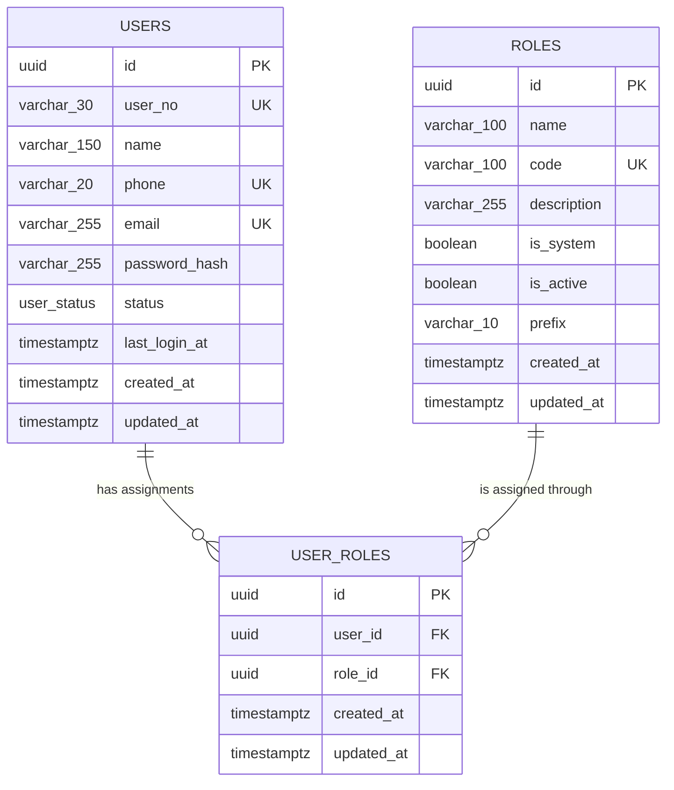

# Database Schema

This document describes the PostgreSQL schema produced by the current Knex migrations in [`src/db/migrations`](../src/db/migrations). The **final schema after all migrations have run** is the source of truth here; objects that existed only temporarily during migration history are called out separately.

## Database overview

| Item                | Value                                                                                     |
| ------------------- | ----------------------------------------------------------------------------------------- |
| Database engine     | PostgreSQL                                                                                |
| Local Docker image  | `postgres:17-alpine`                                                                      |
| Query client        | `pg`                                                                                      |
| Migration tool      | Knex `3.x`                                                                                |
| Application tables  | `users`, `roles`, `user_roles`                                                            |
| Native enum types   | `user_status`                                                                             |
| Custom sequences    | `customer_user_seq`, `admin_user_seq`, `parts_vendor_user_seq`, `service_vendor_user_seq` |
| Migration directory | `src/db/migrations`                                                                       |
| Seed directory      | `src/db/seeds`                                                                            |

Unless a schema is explicitly configured outside this repository, these objects are created in PostgreSQL's active/default schema, normally `public`.

## Entity relationship diagram



The model is many-to-many: a user can have zero or more roles, and a role can be assigned to zero or more users. The database prevents the same role from being assigned to the same user more than once.

## Tables

### `users`

Stores user identity, contact, authentication, status, and audit timestamps.

| Column          | PostgreSQL type | Nullable | Default             | Constraints / purpose                          |
| --------------- | --------------- | -------- | ------------------- | ---------------------------------------------- |
| `id`            | `uuid`          | No       | `gen_random_uuid()` | Primary key                                    |
| `user_no`       | `varchar(30)`   | No       | None                | Unique human-readable user identifier          |
| `name`          | `varchar(150)`  | Yes      | `NULL`              | Display/full name                              |
| `phone`         | `varchar(20)`   | Yes      | `NULL`              | Unique when non-null                           |
| `email`         | `varchar(255)`  | Yes      | `NULL`              | Unique when non-null                           |
| `password_hash` | `varchar(255)`  | Yes      | `NULL`              | Password hash; nullable for OTP-only users     |
| `status`        | `user_status`   | No       | `'ACTIVE'`          | Account lifecycle status                       |
| `last_login_at` | `timestamptz`   | Yes      | `NULL`              | Most recent login time                         |
| `created_at`    | `timestamptz`   | No       | `CURRENT_TIMESTAMP` | Creation time                                  |
| `updated_at`    | `timestamptz`   | No       | `CURRENT_TIMESTAMP` | Last-update time; see timestamp behavior below |

Constraints and indexes:

- Primary key on `id`.
- Unique constraint/index on `user_no`.
- Unique constraint/index on `phone`.
- Unique constraint/index on `email`.
- `status` accepts only values defined by the `user_status` enum.
- No database check currently requires at least one of `phone` or `email`.
- PostgreSQL unique constraints allow multiple `NULL` values, so multiple users can have no phone and/or no email.

`user_no` has no database default and is not automatically connected to any of the custom sequences. Every insert must explicitly supply it unless a later migration adds generation logic.

### `roles`

Defines assignable user roles and their human-readable identifier prefix.

| Column        | PostgreSQL type | Nullable | Default             | Constraints / purpose                           |
| ------------- | --------------- | -------- | ------------------- | ----------------------------------------------- |
| `id`          | `uuid`          | No       | `gen_random_uuid()` | Primary key                                     |
| `name`        | `varchar(100)`  | No       | None                | Human-readable role name                        |
| `code`        | `varchar(100)`  | No       | None                | Unique stable role code                         |
| `description` | `varchar(255)`  | Yes      | `NULL`              | Optional role description                       |
| `is_system`   | `boolean`       | No       | `false`             | Marks built-in/system-managed roles             |
| `is_active`   | `boolean`       | No       | `true`              | Controls whether the role is active             |
| `created_at`  | `timestamptz`   | No       | `CURRENT_TIMESTAMP` | Creation time                                   |
| `updated_at`  | `timestamptz`   | No       | `CURRENT_TIMESTAMP` | Last-update time; see timestamp behavior below  |
| `prefix`      | `varchar(10)`   | No       | None                | Prefix intended for human-readable user numbers |

Constraints and indexes:

- Primary key on `id`.
- Unique constraint/index on `code`.
- `name` is not unique.
- `prefix` is not unique.
- No check constraint restricts the format or casing of `code` or `prefix`.

The original `scope` column and its `role_scope` enum were removed by the latest role migration and are **not** part of the final schema.

### `user_roles`

Join table assigning roles to users.

| Column       | PostgreSQL type | Nullable | Default             | Constraints / purpose                          |
| ------------ | --------------- | -------- | ------------------- | ---------------------------------------------- |
| `id`         | `uuid`          | No       | `gen_random_uuid()` | Primary key for the assignment                 |
| `user_id`    | `uuid`          | No       | None                | Foreign key to `users.id`                      |
| `role_id`    | `uuid`          | No       | None                | Foreign key to `roles.id`                      |
| `created_at` | `timestamptz`   | No       | `CURRENT_TIMESTAMP` | Assignment creation time                       |
| `updated_at` | `timestamptz`   | No       | `CURRENT_TIMESTAMP` | Last-update time; see timestamp behavior below |

Constraints and indexes:

- Primary key on `id`.
- Foreign key `user_id -> users.id` with `ON DELETE CASCADE`.
- Foreign key `role_id -> roles.id` with `ON DELETE RESTRICT`.
- Composite unique constraint/index on `(user_id, role_id)` prevents duplicate assignments.
- No explicit `ON UPDATE` action is configured, so PostgreSQL uses its default (`NO ACTION`).
- PostgreSQL does not automatically index foreign-key columns. The composite unique index supports lookups beginning with `user_id`, but there is no dedicated index for queries beginning with only `role_id`.

Delete behavior:

- Deleting a user automatically deletes all of that user's `user_roles` rows.
- Deleting a role is rejected while any `user_roles` row references it.
- Deleting a `user_roles` row does not delete either its user or role.

## Enum types

### `user_status`

Native PostgreSQL enum used by `users.status`.

| Value       | Intended meaning              |
| ----------- | ----------------------------- |
| `ACTIVE`    | User can be treated as active |
| `INACTIVE`  | User is inactive              |
| `SUSPENDED` | User is temporarily suspended |
| `BLOCKED`   | User is blocked               |

Because this is a native PostgreSQL enum, adding, removing, or renaming a status requires a database migration.

### Removed enum: `role_scope`

The first roles migration created `role_scope` with `ADMIN` and `PARTNER`. Migration `20260811124155_remove_scope_column_from_roles.js` drops both the `roles.scope` column and the enum type. It exists only as migration history and should not be used by current application code.

## Custom sequences

The users migration creates four independent PostgreSQL sequences:

| Sequence                  | Starts at | Likely role association | Seeded role prefix |
| ------------------------- | --------: | ----------------------- | ------------------ |
| `admin_user_seq`          |         1 | `ADMIN`                 | `KAD`              |
| `customer_user_seq`       |         1 | `CUSTOMER`              | `KCU`              |
| `parts_vendor_user_seq`   |         1 | `SPARE_PARTS_VENDOR`    | `KPV`              |
| `service_vendor_user_seq` |         1 | `SERVICE_VENDOR`        | `KSV`              |

The association above is inferred from sequence names and seeded roles. The migrations do not bind these sequences to a table column, set them as `users.user_no` defaults, or define a trigger/function that formats identifiers. They retain PostgreSQL's normal sequence defaults such as incrementing by one and not cycling. Application or database logic must call `nextval(...)`, apply the relevant prefix/padding, and insert the resulting unique `user_no`.

Sequence values are not gapless: rollbacks, failed transactions after `nextval`, and concurrent allocation can leave gaps. Code should treat the generated number as an identifier, not as a row count.

## Seed data

[`src/db/seeds/roles.js`](../src/db/seeds/roles.js) deletes all existing rows from `roles` and inserts these built-in roles:

| `name`           | `code`               | `prefix` | `is_system` | `is_active` | `description` |
| ---------------- | -------------------- | -------- | ----------- | ----------- | ------------- |
| `admin`          | `ADMIN`              | `KAD`    | `true`      | `true`      | `NULL`        |
| `customer`       | `CUSTOMER`           | `KCU`    | `true`      | `true`      | `NULL`        |
| `parts_vendor`   | `SPARE_PARTS_VENDOR` | `KPV`    | `true`      | `true`      | `NULL`        |
| `service_vendor` | `SERVICE_VENDOR`     | `KSV`    | `true`      | `true`      | `NULL`        |

Because `user_roles.role_id` uses `ON DELETE RESTRICT`, rerunning this destructive seed after roles have been assigned will fail unless dependent assignments are removed first. Role IDs are regenerated each time because the seed does not provide fixed UUIDs.

## Timestamp behavior

All three tables use Knex `table.timestamps(true, true)`. With the PostgreSQL client this creates `created_at` and `updated_at` as non-null `timestamptz` columns defaulting to `CURRENT_TIMESTAMP`.

The default is evaluated on insert only. Knex does not create an automatic PostgreSQL `ON UPDATE` trigger, so update queries must explicitly set `updated_at` if it is expected to change.

## Migration history

Migrations run in filename order:

1. [`20260811103559_create_roles_table.js`](../src/db/migrations/20260811103559_create_roles_table.js) creates `roles` and the historical `role_scope` enum.
2. [`20260811111226_create_users_table.js`](../src/db/migrations/20260811111226_create_users_table.js) creates the four custom sequences, `users`, and `user_status`.
3. [`20260811121708_add_prefix_column_to_roles_table.js`](../src/db/migrations/20260811121708_add_prefix_column_to_roles_table.js) adds the required `roles.prefix` column.
4. [`20260811122352_create_user_roles_table.js`](../src/db/migrations/20260811122352_create_user_roles_table.js) creates the user/role join table and foreign keys.
5. [`20260811124155_remove_scope_column_from_roles.js`](../src/db/migrations/20260811124155_remove_scope_column_from_roles.js) removes `roles.scope` and drops `role_scope`.

Rollback behavior is the reverse:

- The latest migration recreates `roles.scope` and `role_scope`; because `scope` is non-null and has no default/backfill, rolling it back against a populated `roles` table may require manual data handling.
- Rolling back `user_roles` drops the join table.
- Rolling back the prefix migration drops `roles.prefix`.
- Rolling back the users migration drops `users`, `user_status`, and all four custom sequences.
- Rolling back the initial roles migration drops `roles` and `role_scope`.

The prefix migration also adds a non-null column without a default or backfill. It is safe on an empty `roles` table, but applying it to a database where roles already exist can fail until existing rows receive prefix values.

## Knex-managed metadata

When migrations are run, Knex also creates framework-owned metadata tables (normally `knex_migrations` and `knex_migrations_lock`). They record applied migration names/batches and coordinate the migration lock. They are operational metadata, not application-domain tables, and application queries should not modify them.

## Database configuration and commands

Runtime database configuration is read from environment variables in [`src/config/env.js`](../src/config/env.js):

| Variable                | Required / default | Purpose                                 |
| ----------------------- | ------------------ | --------------------------------------- |
| `DB_HOST`               | Required           | PostgreSQL host                         |
| `DB_PORT`               | Default `5432`     | PostgreSQL port                         |
| `DB_USER`               | Required           | Database user                           |
| `DB_PASSWORD`           | Required           | Database password                       |
| `DB_NAME`               | Required           | Database name                           |
| `DB_POOL_MAX`           | Default `10`       | Maximum runtime pool size               |
| `DB_IDLE_TIMEOUT`       | Default `30000` ms | Idle connection timeout                 |
| `DB_CONNECTION_TIMEOUT` | Default `2000` ms  | Connection timeout                      |
| `DB_SSL`                | Default `false`    | Enables runtime TLS when exactly `true` |

[`knexfile.js`](../knexfile.js) defines the `development` migration/seed connection with `DB_HOST`, `DB_PORT`, `DB_USER`, `DB_PASSWORD`, and `DB_NAME`.

```bash
npm run migrate
npm run migrate:rollback
npm run seed
```

## Current schema/application gaps

The migration-backed schema and current repository code are not fully aligned:

- Several repositories insert or read `users.password`, but the migrated column is `users.password_hash`.
- Current user creation queries do not supply required `users.user_no`, so those inserts will fail against this schema.
- No repository currently consumes the four sequences or generates `user_no`.
- Authentication repository/test code references a `sessions` table, but no current migration creates one.

These are implementation gaps, not additional schema objects. Until migrations or repositories are updated, application flows that depend on those columns/tables cannot rely on the schema documented above.

## Schema invariants summary

- IDs for all application tables are database-generated UUIDs.
- Every user has a unique, explicitly supplied `user_no`.
- User email and phone are optional, but unique when present.
- Every role has a unique `code` and a required `prefix`.
- Every role assignment references an existing user and role.
- A `(user_id, role_id)` pair can occur only once.
- User deletion cascades to assignments; role deletion is restricted while assigned.
- Timestamps are timezone-aware and initialized automatically, but `updated_at` is not maintained automatically.
